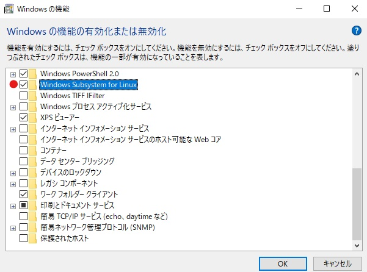
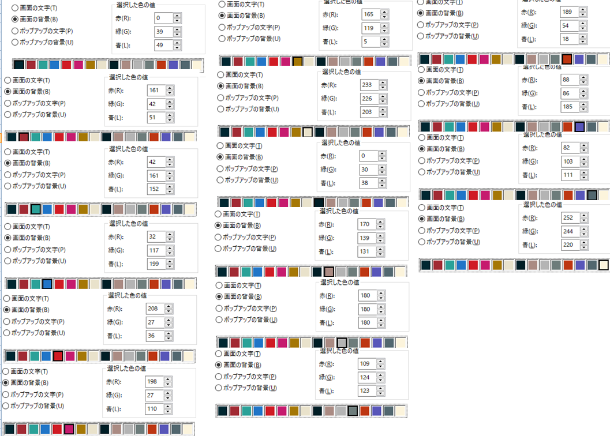
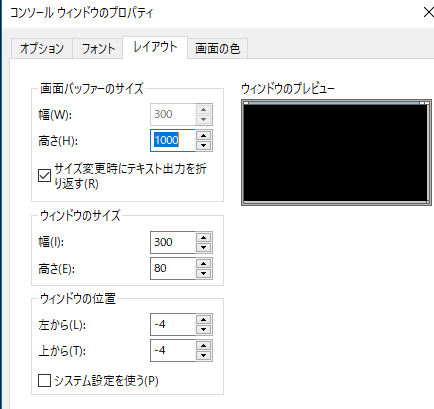
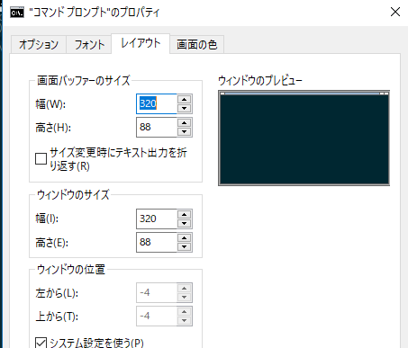

# Windows Subsystem for Linux

## インストール
- - -

1. 設定 > 更新とセキュリティ > 開発者向け ： 開発者モードON
1. WSL有効
<br>
1. インストール

```
$ lxrun /install
```

## cmdの管理者で起動
- ~~win-r `cmd` shift-Enter~~ `win cmd` Right-Click Administrator

## 色変更
- - -

- ツールでの変更が基本。
1. https://github.com/Microsoft/console
1. VSでビルド。
1. exeを移動して実行。
```cmd
$ move -p C:\tools\ColorTool\ColorTool\bin\Release\colortool.exe C:\tools\ColorTool
$ move -p C:\tools\ColorTool\ColorTool\bin\Release\colortool.exe.config C:\tools\ColorTool
$ .\colortool.exe solarized_dark
```

- Color Schemeb `./cmd-color-scheme.reg`




## バッファーサイズ
- property
<br>
- default
<br>

## パッケージ更新
- - -

### 海外サーバ >>> 日本サーバ（初回一回のみ）

```
sudo sed -i -e 's%http://.*.ubuntu.com%http://ftp.jaist.ac.jp/pub/Linux%g' /etc/apt/sources.list
```

### 最新に（基本いつも）

```
$ sudo apt update
$ sudo apt upgrade
```

## 開発ツールのインストール
- - -

~~$ sudo yum groupinstall "Development Tools"~~
```
$ sudo apt-get install build-essential
```

## Git
- - -
- ~~新しいものをインストール~~ 公式リポのバージョンは古い

```
$ sudo apt-get install apt-file
$ sudo apt-file update
$ sudo apt-file search add-apt-repository
$ sudo apt-get install software-properties-common

#非公式リポジトリの追加
$ sudo add-apt-repository ppa:git-core/ppa
$ sudo apt-get update
$ sudo apt-get upgrade
#gitのインストール
$ sudo apt-get install git

$ git --version
```

## tig
```
$ sudo apt-get install tig
```

## tmux

- 最新版を使用するため、ソースを取得しコンパイルする。(GitHubにSSHキー登録済みであること)

```
$ dpkg -l | grep tmux
# varsion x.x-xbuild1
$ sudo apt update
# 18/08/28 added for error of autogen.sh
$ sudo apt-get -y install pkg-config libtool
$ sudo apt install -y build-essential automake libevent-dev ncurses-dev
$ mkdir -p ~/src
$ mkdir -p ~/bin
$ cd ~/src
$ git clone git@github.com:tmux/tmux.git
$ cd ~/src/tmux
$ sh autogen.sh
$ ./configure
$ make
$ cp ~/src/tmux/tmux /usr/local/bin/
```

## Vim
[Installation](../../Vim/README.md)

## Custom `history.sh`
[history.sh](../../My-Linux-Config-Set/README.md)

### OS間のファイル区切り文字がちがいを解決

1. 以下を.bashrcに追加

```
function winpath()
{
  if [ -p /dev/stdin ]; then
    input_path=$(cat -)
  else
    input_path=$(echo $@)
  fi
  /bin/readlink -f $input_path | sed -e "s|^\(/mnt/\([a-z]\)\)\(.*\)|\U\2:\E\3|" -e "s|/|\\\\|g"
}

function linuxpath()
{
  if [ -p /dev/stdin ]; then
    input_path=$(cat -)
  else
    input_path=$(echo $@)
  fi

  echo $input_path | sed -e "s|\\\\|/|g" -e "s|^\([A-Za-z]\)\:/\(.*\)|/mnt/\L\1\E/\2|"
}

export TMPDIR=`echo "$(/mnt/c/Windows/System32/cmd.exe /C echo %TEMP%)" | tr -d "\r" | linuxpath`
```

## アンインストール
- - -
（コマンドプロンプトの配色設定は残る）
```
lxrun /uninstall /full
```
